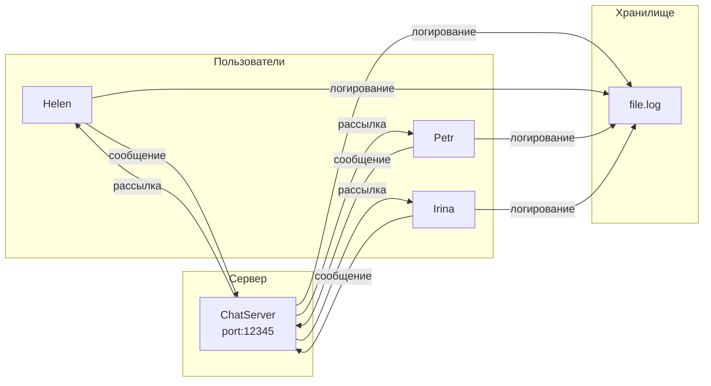

# Чат-приложение (Клиент-Сервер)

## Архитектура




## Общая схема взаимодействия
```mermaid
graph TD
    subgraph Сеть
        Client1[Клиент #1<br/>Helen]
        Client2[Клиент #2<br/>Petr]
        Client3[Клиент #3<br/>Ivan]
        Server[СЕРВЕР<br/>Порт:12345]
        
        Client1 <--> Server
        Client2 <--> Server
        Client3 <--> Server
    end
    
    Server --> Log[(file.log)]
    Client1 --> Log
    Client2 --> Log
    Client3 --> Log

